# Appearance

## 通用可配项

1. `Appearance.pageContainerTitleBarItemWidth` 底部弹窗页面titleBar的高宽度,文件请在Xcode files中搜索`PageContainerTitleBar.swift`
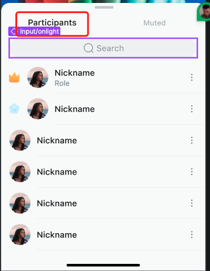

2. `Appearance.pageContainerConstraintsSize` 底部弹窗页面的宽高,文件请在Xcode show the finder navigation中搜索此属性即可看到在哪里应用,主要使用类在Xcode files中搜索 `PageContainersDialogController.swift`
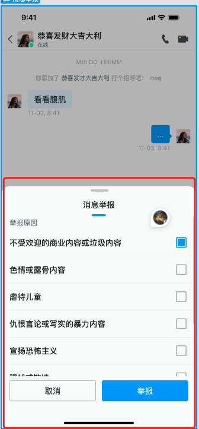

3. `Appearance.alertContainerConstraintsSize`Alert居中类型弹窗宽高。主要使用类在Xcode files中搜索 `AlertController.swift`
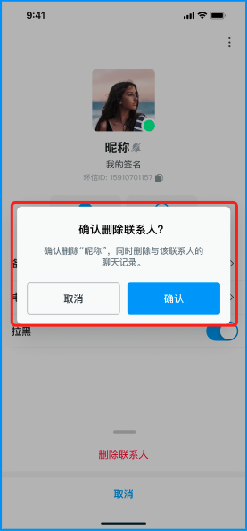

4. `Appearance.alertStyle` 弹窗的圆角样式，大圆角还是小圆角

5. `Appearance.primaryHue` 主色调，用于按钮、输入框等控件的背景色

6. `Appearance.secondaryHue` 辅色调，用于按钮、输入框等控件的背景色

7. `Appearance.errorHue` 错误色调

8. `Appearance.neutralHue` 中性色调

9. `Appearance.neutralSpecialHue` 中性特殊色调

10. `Appearance.avatarRadius` 头像圆角 分为极小、小、中、大等四个等级。

11. `Appearance.actionSheetRowHeight` ActionSheet Cell的行高
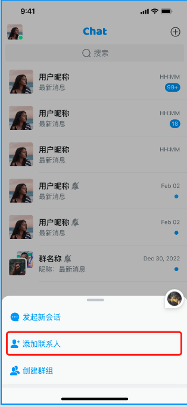

12. `Appearance.avatarPlaceHolder` 头像占位图

## 会话列表可配项

1. `Appearance.conversation.rowHeight` 会话列表Cell的高度
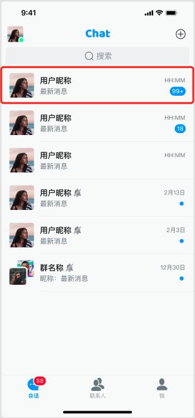

2. `Appearance.conversation.swipeLeftActions` 会话列表左滑菜单项
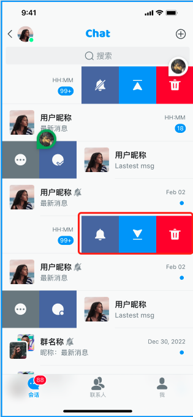

3. `Appearance.conversation.swipeRightActions` 会话列表右滑菜单项

4. `Appearance.conversation.singlePlaceHolder` 会话列表单聊会话头像占位图
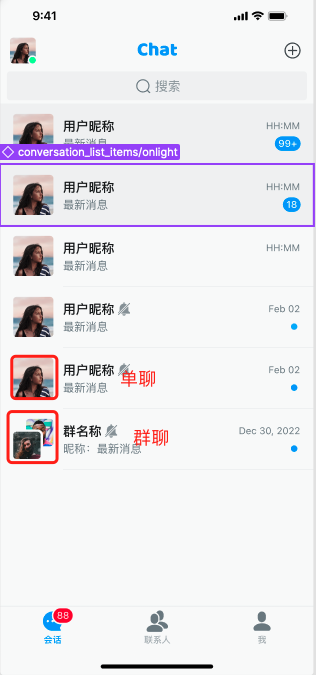

5. `Appearance.conversation.groupPlaceHolder` 会话列表群聊会话头像占位图

6. `Appearance.conversation.dateFormatToday` 今天的日期格式
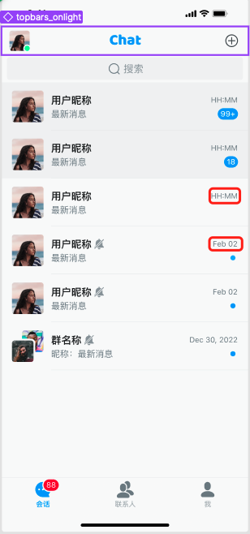

7. `Appearance.conversation.dateFormatOtherDay` 非今天的日期格式

8. `Appearance.conversation.moreActions` 右滑会话后出现的`...`菜单项点击后的ActionSheet的菜单项
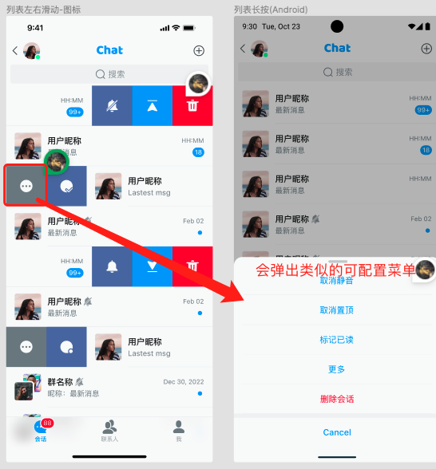

9. `Appearance.conversation.listMoreActions` 会话列表右上角的`+`点击后的ActionSheet的菜单项
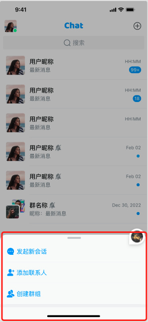

## 联系人列表及其后续页面可配项

1. `Appearance.contact.rowHeight` 联系人列表Cell的高度
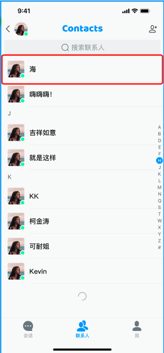

2. `Appearance.contact.headerRowHeight` 联系人列表Header Cell的高度
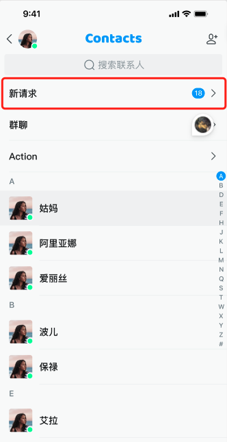

3. `Appearance.contact.listHeaderExtensionActions` 联系人列表Header List数据源
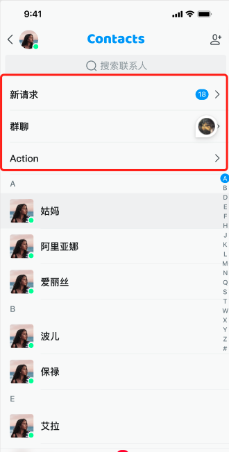

4. `Appearance.contact.detailExtensionActionItems` 联系人以及群组详情header中可配菜单项，主要功能有聊天、音视频通话等。
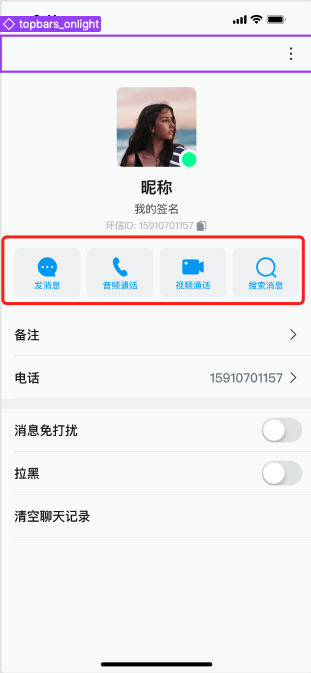

5. `Appearance.contact.moreActions` 联系人以及群组详情右上角的`...`点击后的ActionSheet的菜单项
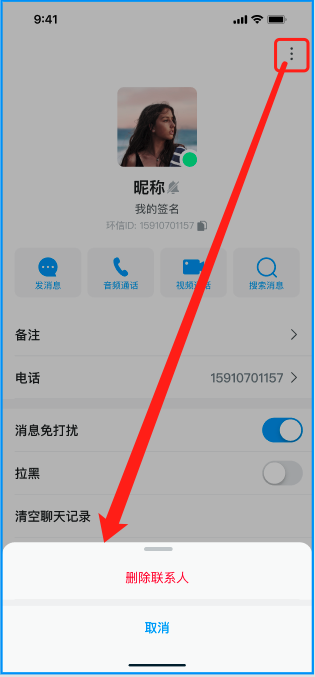

## 聊天页面可配项

1. `Appearance.chat.maxInputHeight` 聊天页面输入框最大输入高度
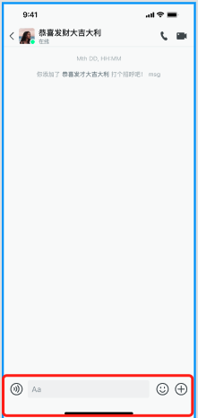

2. `Appearance.chat.inputPlaceHolder` 聊天页面输入框默认占位符

3. `Appearance.chat.inputBarCorner` 聊天页面输入框圆角

4. `Appearance.chat.bubbleStyle` 聊天页面消息气泡的样式分为带箭头与多圆角两种
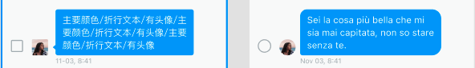

5. `Appearance.chat.contentStyle` 聊天页面消息中显示内容的可配项数组，可以将不想要的功能移除即可。
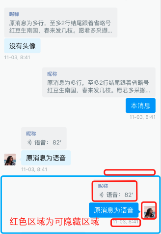

6. `Appearance.chat.messageLongPressedActions` 聊天页面长按消息后的ActionSheet菜单项
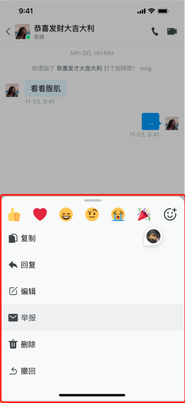

7. `Appearance.chat.reportSelectionTags` 聊天页面消息举报时的举报类型
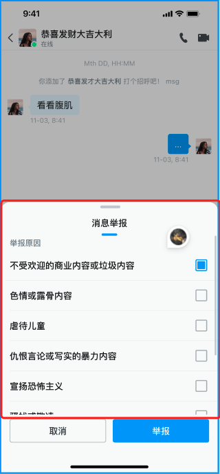

8. `Appearance.chat.reportSelectionReasons` 聊天页面消息举报时的举报原因

9. `Appearance.chat.inputExtendActions` 聊天页面输入框右侧`+`点击后ActionSheet菜单项

10. `Appearance.chat.dateFormatToday` 聊天页面消息今天的日期格式
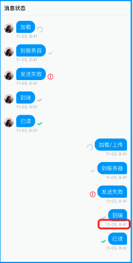

11. `Appearance.chat.dateFormatOtherDay` 聊天页面消息非今天的日期格式

12. `Appearance.chat.audioDuration` 聊天页面语音消息录制的最大时长
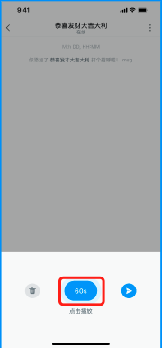

13. `Appearance.chat.receiveAudioAnimationImages` 聊天页面接收方语音消息播放时的动画图片
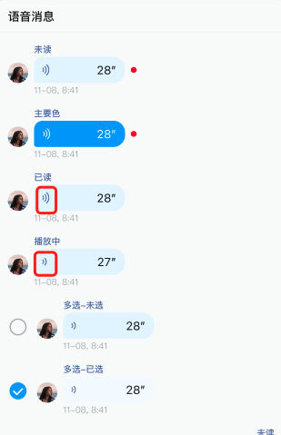

14. `Appearance.chat.sendAudioAnimationImages` 聊天页面发送方语音消息播放时的动画图片

15. `Appearance.chat.receiveBubbleColor` 聊天页面接收方消息气泡颜色
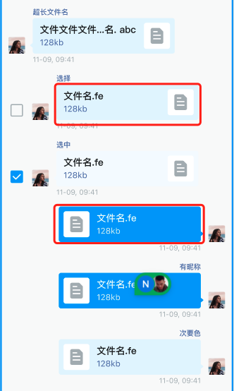

16. `Appearance.chat.sendBubbleColor` 聊天页面发送方消息气泡颜色

17. `Appearance.chat.receiveTextColor` 聊天页面接收方消息文字颜色
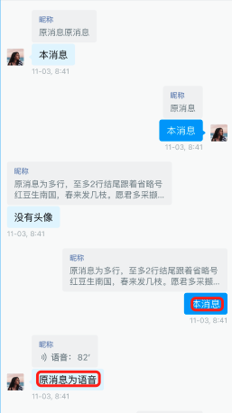

18. `Appearance.chat.sendTextColor` 聊天页面发送方消息文字颜色

19. `Appearance.chat.imageMessageCorner` 聊天页面图片消息圆角
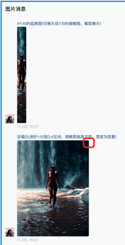

20. `Appearance.chat.imagePlaceHolder` 聊天页面图片消息占位图

21. `Appearance.chat.videoPlaceHolder` 聊天页面视频消息占位图

22. `Appearance.chat.recallExpiredTime` 聊天页面消息撤回的有效时间

23. `Appearance.chat.newMessageSoundPath` 聊天页面收到新消息时的播放音频文件的路径

